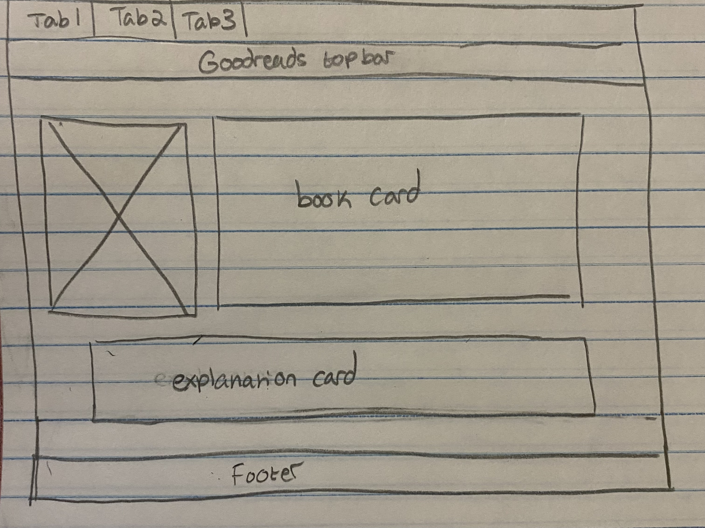

### Project-Delta

## Date 11/17/2025
## Author: Maria Dukes

## Purpose of the App

This app redesigns a frustrating UI aspect that occurs when attempting to share a book in Goodreads. The goal is to make it easier to share a book with friends on the same app, and reduce the time it takes to commit to a simple action.

## Tagline

Cease the frustration, and simplify your sharing experience!

## User Story

**As a** Goodreads user,
**I want** a more direct way to share books with friends,
**So that** I can send book recommendations without having to copy down a URL or for the reciever to switch apps

## Test Case

The test case counts the number of clicks the user does to share their chosen book (this click counter is active for both the "problem page" and the "solution page").

In addition, the "solution page" does not require the user to exit Goodreads to share their book.

- Every click increments the counter
- Each click is logged
- User stays on same page

## Before (Problem Page)
- When the user clicked on share, only three social media options appeared as well as a "copy URL" option
- If a user chose to copy the URL they would have to select a messaging app and share it through there
- The reciever is looped back, but if they do not have the app or is not signed in, they will have to go through that process again
- Despite having a friend feature, Goodreads does not faciliate a direct interaction with your friends

## After (Solution Page)
- Now when the share button is clicked it brings up a sliding page that shows your list of friends
- The previous options remain on the bottom
- Quick, easy, and direct actions that allow the user to remain on the page

## Tech Stack
- HTML5 (Page structure and layout)
- CSS3 (Goodreads theme, style, cards, grids, animations)
- Bootstrap 5 (tabs)
- Normalize.css
- JavaScript (ES6) (popups, slide-up page, metric tracker, try/catch)
- GitHub Pages (Hosting and deployment)

## Wireframe



## Code Snippet

```JavaScript
document.addEventListener("DOMContentLoaded", () => {
  try {
    console.log("Share UI script loaded.");

    // Metric: times clicked
    let shareClickCount = 0;

    // All pages have a share icon
    const shareBtn = document.querySelector(".share-icon");
    if (!shareBtn) throw new Error("Share button not found on this page.");

    // Problem page popup

    const sharePopup = document.getElementById("shareSquare");
    const closeShare = document.querySelector(".close-share");

    if (sharePopup && closeShare) {
      console.log("Problem page detected: initializing popup behavior.");

      shareBtn.addEventListener("click", () => {
        shareClickCount++;
        console.log(
          `Problem page: share clicked ${shareClickCount} time(s).`
        );
        sharePopup.classList.toggle("active");
      });

      closeShare.addEventListener("click", () => {
        sharePopup.classList.remove("active");
      });
    }

    // Solution page slide-up sheet
    
    const shareSheet = document.getElementById("shareSheet");
    const closeSheet = document.querySelector(".close-sheet");

    if (shareSheet && closeSheet) {
      console.log("Solution page detected: initializing slide-up sheet.");

      shareBtn.addEventListener("click", () => {
        shareClickCount++;
        console.log(
          `Solution page: share clicked ${shareClickCount} time(s).`
        );
        shareSheet.classList.add("active");
      });

      closeSheet.addEventListener("click", () => {
        shareSheet.classList.remove("active");
      });
    }

  } catch (error) {
    console.error("Error initializing share UI:", error);
  }
});

```

- Tracks buttons clicked/logs user interaction
- Allows popups, and slide-sheet features
- try/catch for errors

## Resource Links

- **Live Link:** https://mdukes0.github.io/project-delta/
- **GitHub Repo**: https://github.com/mdukes0/project-delta
- **Nu validator**: https://github.com/mdukes0/project-delta
- **Wave**: https://wave.webaim.org/report#/https://mdukes0.github.io/project-delta/

## Attribution
- Goodreads reference/palette color
- StackOverflow & MDN (CSS/JS patterns and syntax)
- W3Schools
- -Nomralize.css (CDN)
- Bootstrap 5 (CDN)
- ChatGPT-5.1 (error review, JavaScript, slide-sheet CSS & HTML, README review)


